# Pipeawesome 2

## Table of contents

*   [As my mum would say... accusingly... "WHAT did YOU do?!?!?!"](#as-my-mum-would-say-accusingly-what-did-you-do)

*   [Why did you do this?](#why-did-you-do-this)

*   [So why do you love UNIX pipes?](#so-why-do-you-love-unix-pipes)

*   [So what does this project add?](#so-what-does-this-project-add)

*   [An example project](#an-example-project)

    *   [Data Format](#data-format)

    *   [Drawing the grid](#drawing-the-grid)

        *   [Connection / Connection Sets](#connection--connection-sets)
        *   [Faucet](#faucet)
        *   [Launch](#launch)
        *   [Drain](#drain)

    *   [Having a Go](#having-a-go)

    *   [Picking a random player to start the game](#picking-a-random-player-to-start-the-game)

        *   [Code for generating the random player](#code-for-generating-the-random-player)

    *   [A complete game](#a-complete-game)

        *   [Multiple turns](#multiple-turns)
        *   [Alternating players](#alternating-players)

*   [Component Types](#component-types)

    *   [Component: Faucet](#component-faucet)
    *   [Component: Launch](#component-launch)
    *   [Component: Drain](#component-drain)
    *   [Component: Junction](#component-junction)
    *   [Component: Buffer & Regulator](#component-buffer--regulator)

*   [Pipe Variations, Output Types and Input Priorities.](#pipe-variations-output-types-and-input-priorities)

    *   [Pipe Variations](#pipe-variations)
    *   [Output Types](#output-types)
    *   [Input Priorities](#input-priorities)

*   [Appendix](#appendix)

    *   [Pipeawesome Graph Legend](#pipeawesome-graph-legend)
    *   [Component Diagram Legend](#component-diagram-legend)

## As my mum would say... accusingly... "WHAT did YOU do?!?!?!"

I added loops, branches and joins to UNIX pipes.

## Why did you do this?

I feel UNIX pipes are underappreciated and should be considered more often.

## So why do you love UNIX pipes?

UNIX pipes are wonderful as when you write software using them they have:

*   High performance.
*   Back Pressure.
*   Really easy to reason about at the individual UNIX process level (it's just STDIN and STDOUT/STDERR).
*   Insanely light and zero infrastructure compared to a "proper" solution.
*   Easily to integrate with a "proper" solution when the need arises.

## So what does this project add?

Given a UNIX pipeline like `cat myfile | awk 'PAT { do something }' | grep '^good' | awk '$1='good' { print /dev/stdout } else { print /dev/stderr }' | sed 's/good/perfect' | sort` and this is powerful and wonderful.

This could be visualized like the following:

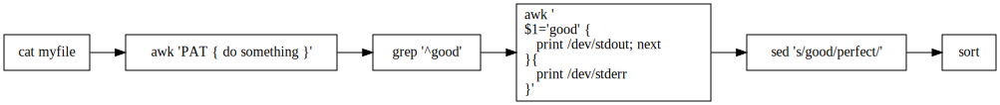

However it might be that you want to:

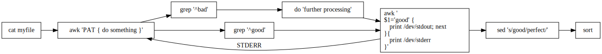

Some or all of this is possible to do with tools like `mkfifo`, depending on your skill level, but you certainly won't end up with something that is anywhere near as easy for someone to follow as the simple UNIX command shown earlier.

## An example project

I decided to make a tic-tac-toe game to demonstrate the capabilities of this project.

This game would have:

*   A data format which can be translated into **a human recognizable tic-tac-toe grid** with squares filled in.
*   Two **computer players**.
*   They would **take turns to pick a blank square** and fill it with their "X" or "O".
*   A **referee** to decide when the game had been won or was a draw.

### Data Format

I first decided on a data format which looks like the following:

STATUS **:** SQUARE\_1 **:** SQUARE\_2 **:** SQUARE\_3 **:** SQUARE\_4 **:** SQUARE\_5 **:** SQUARE\_6 **:** SQUARE\_7 **:** SQUARE\_8 **:** SQUARE\_9

In this `STATUS` would be either `X`, `O` for player turns or *something else* to denote game draws / wins.

### Drawing the grid

I next coded up something which would show the grid. I coded a lot of this in GNU AWK because it's something that I'm learning off-and-on and (very) simple `STDIN | STDOUT` coding seems ideally suited to the language.

I came up with the following code:

```awk file=./examples/tic-tac-toe/draw.awk
function get_player_text(player_O_or_X) {
    extra = ""
    if (player_O_or_X == "D") {
        return "DRAW!";
    }
    if (player_O_or_X ~ "^W") {
        extra = "WON!"
        player_O_or_X = substr(player_O_or_X, 2)
    }
    return "Player " player_O_or_X " " extra
}
function draw_turn_line(pos_1, pos_2, pos_3) {
    return sprintf(" %-1s | %-1s | %-1s ", pos_1, pos_2, pos_3)
}
function draw_line_line() {
    return "---+---+---"
}
BEGIN { GAME_NUMBER = 0 }
{
    print get_player_text($1) # " (" $0 ")"
    print ""
    print draw_turn_line($2, $3, $4)
    print draw_line_line()
    print draw_turn_line($5, $6, $7)
    print draw_line_line()
    print draw_turn_line($8, $9, $10)
    print ""
    fflush()
}
```

You can execute this code with `echo O:::X::O::::X' | gawk -F ':' -f ./examples/tic-tac-toe/draw.awk` and it'll draw you the following grid:

```text
Player O 

   |   | X 
---+---+---
   | O |   
---+---+---
   |   | X 
```

I then wrote a Pipeawesome configuration file which wraps this:

```yaml file=./examples/tic-tac-toe/draw.pa.yaml
connection:
  initial: "faucet:input | launch:draw | drain:output"
drain:
  output:
    destination: '-'
faucet:
  input:
    source: '-'
launch:
  draw:
    cmd: "awk"
    arg:
      - '-F'
      - ':'
      - '-f'
      - 'examples/tic-tac-toe/draw.awk'
```

Which could be visualized as:

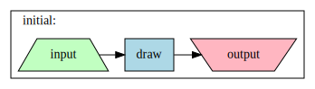

<sub>**NOTE**: I got Pipeawesome drew this graph by running `./target/debug/pipeawesome2 graph --config examples/tic-tac-toe/draw.pa.yaml --diagram-only`.</sub>

<sub>**NOTE**: Using `./target/debug/pipeawesome2 graph --config examples/tic-tac-toe/draw.pa.yaml --legend-only` will generate the graphs legend, this is common for all graphs and shown [in the appendix](#pipeawesome-graph-legend).</sub>

In Pipeawesome there are pipes, which connect different types of components. The components types here are `faucet`, `launch` and `drain` with the names of those components being `input`, `draw` and `output`. The names are just names, but they may need to be referenced elsewhere within the configuration file depending on the component type.

You could execute this Pipeawesome configuration file with `echo 'O:::X::O::::X' | ./target/debug/pipeawesome2 process --config examples/tic-tac-toe/draw.pa.yaml`

This is of course, a trivial and pointless example because you'd run awk directly, but it allows me to show you the Pipeawesome file format with minimal complexity.

Lets break it down into it's constituent parts:

#### Connection / Connection Sets

```yaml
connection:
  initial: "faucet:input | launch:draw | drain:output"
```

Connection sets explain how to join components together. There can be multiple connection sets, but here there is just one.

For more information please see [Pipe Variations, Output Types and Input Priorities.](#pipe-variations-output-types-and-input-priorities).

#### Faucet

```yaml
faucet:
  input:
    source: '-'
```

A Faucet is the main way to get data into Pipeawesome from the outside world, the configuration here is for the one named `input`.

For more information please see [Component: Faucet](#component-faucet).

<sub>**NOTE**: It is perfectly valid for a Launch to also generate the initial data, in which case a Faucet would not be required.</sub>

#### Launch

```yaml
launch:
  draw:
    cmd: "awk"
    arg:
      - '-F'
      - ':'
      - '-f'
      - 'examples/tic-tac-toe/draw.awk'
```

This controls how the programs are executed.

For more information please see [Component: Launch](#component-launch).

#### Drain

```yaml
drain:
  output:
    destination: '-'
```

This is how data exits Pipeawesome. Output can be sent to STDOUT, STDERR or a file.

For more information please see [Component: Drain](#component-drain).

<sub>**NOTE**: If writing to a queueing solution such as RabbitMQ or AWS SQS you could use a Launch instead.</sub>

### Having a Go

Let's let the player take their turn.

The following configuration includes new code, but the configuration adds no concepts that you've not already seen:

```yaml file=./examples/tic-tac-toe/have_a_go.pa.yaml
connection:
  initial_word: "f:input | l:player | l:referee | l:draw | d:output"
drain:
  output: { destination: '-' }
faucet:
  input: { source: '-' }
launch:
  player:
    cmd: "gawk"
    arg: [ '-F', ':', '-v', 'PLAYER=O', '-f', 'examples/tic-tac-toe/player.awk' ]
  referee:
    cmd: "gawk"
    arg: ['-F', ':', '-f', './examples/tic-tac-toe/referee.awk', 'NF=10', 'OFS=:']
  draw:
    cmd: "gawk"
    arg: [ '-F', ':', '-f', 'examples/tic-tac-toe/draw.awk' ]
```

Which could be visualized as:

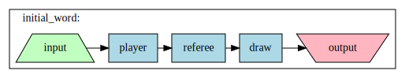

It can be executed with `echo 'O:::X::O::::X' | ./target/debug/pipeawesome2 process --config examples/tic-tac-toe/have_a_go.pa.yaml`

The output from this will be the same as previous but with an extra `O` somewhere on the grid:

```text
Player O 

   |   | X 
---+---+---
   | O |   
---+---+---
 O |   | X 
```

<sub>**NOTE**: There is one extra `O` than in in the input, this was added by `player.awk`.</sub>

### Picking a random player to start the game

#### Code for generating the random player

I figured out that `echo $((RANDOM % 2))::::::::: | sed "s/1/X/" | sed "s/0/O/"` is a single line BASH snippet for selecting a random first player.

However this still means I have to let the selected player take that turn, which means I must explain what a **Junction** is.

A **Junction** is a prioritized many-to-many connector. Anything that comes into any one of it's inputs will be sent to all of it's outputs.

For more information please see [Component: Junction](#component-junction).

After adding the junctions and supporting changes, the full configuration looks like this:

```yaml file=./examples/tic-tac-toe/random_player.pa.yaml
connection:
  random_selection: "l:random_player | junction:turn"
  player_o_branch: "junction:turn | l:player_o_filter | l:player_o | junction:draw"
  player_x_branch: "junction:turn | l:player_x_filter | l:player_x | junction:draw"
  last_draw: "junction:draw | l:referee | l:draw | d:output"
drain:
  output: { destination: '-' }
launch:
  random_player:
    cmd: "bash"
    arg: [ '-c', 'echo $((RANDOM % 2))::::::::: | sed "s/1/X/" | sed "s/0/O/"' ]
  player_o_filter: { cmd: "grep", arg: [ "--line-buffered", "^O" ] }
  player_o:
    cmd: "gawk"
    arg: [ '-F', ':', '-v', 'PLAYER=O', '-f', 'examples/tic-tac-toe/player.awk' ]
  player_x_filter: { cmd: "grep", arg: [ "--line-buffered", "^X" ] }
  player_x:
    cmd: "gawk"
    arg: [ '-F', ':', '-v', 'PLAYER=X', '-f', 'examples/tic-tac-toe/player.awk' ]
  referee:
    cmd: "gawk"
    arg: ['-F', ':', '-f', './examples/tic-tac-toe/referee.awk', 'NF=10', 'OFS=:']
  draw:
    cmd: "gawk"
    arg: [ '-F', ':', '-f', 'examples/tic-tac-toe/draw.awk' ]
```

The graphs drawn by Pipeawesome now become much more interesting:

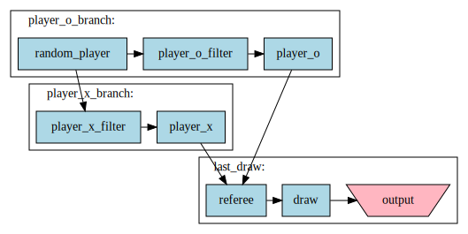

The changes are:

The Faucet configuration has been completely removed (it is not required), in this situation, the initial message comes from `l:random_player`. I have also added / changed some Launch.

The big change is that there are now multiple keys / connections sets / lines within `connection:`. You may notice that the `random_selection:` connection set writes to `junction:turn` but `junction:turn` is read in both the `player_o_branch` and `player_x_branch` connection sets, which in turn both write to `junction:draw`. The connection set names are completely arbitrary, though they must be unique.

<sub>**NOTE**: It is important to know that both `l:player_o_filter` and `l:player_x_filter` both recieve the lines generated by `l:random player`. It is just the case that one of them always filters it out.</sub>

Running this code results in a grid where either an `O` or `X` could be anywhere on the grid:

```text
Player X 

   |   |   
---+---+---
   |   |   
---+---+---
 X |   |   
```

### A complete game

To create the full game, there are two more things that need to happen:

1.  Multiple turns - To complete a game we must have multiple turns take place.
2.  Alternating players - The player that takes the next turn must different from the previous turn.

#### Multiple turns

This is simple, all we need to do is take our previous configuration, add a junction between `launch:referee` and `launch:draw` and feed a new branch all the way back into `junction:turn`. The configuration now looks like:

```yaml file=examples/tic-tac-toe/multiple_turns.pa.yaml -d
connection:
  random_selection: "l:random_player | j:turn"
  player_o_branch: "j:turn | l:player_o_filter | l:player_o | j:draw"
  player_x_branch: "j:turn | l:player_x_filter | l:player_x | j:draw"
  last_draw: "j:draw | l:referee | j:loop | l:draw | d:output"
  looper: "j:loop | j:turn"
drain:
  output: { destination: '-' }
launch:
  random_player:
    cmd: "bash"
    arg:
      - '-c'
      - 'echo $((RANDOM % 2))::::::::: | sed "s/1/X/" | sed "s/0/O/"'
  player_o_filter: { cmd: "grep", arg: [ "--line-buffered", "^O" ] }
  player_o:
    cmd: "gawk"
    arg: [ '-F', ':', '-v', 'PLAYER=O', '-f', 'examples/tic-tac-toe/player.awk' ]
  player_x_filter: { cmd: "grep", arg: [ "--line-buffered", "^X" ] }
  player_x:
    cmd: "gawk"
    arg: [ '-F', ':', '-v', 'PLAYER=X', '-f', 'examples/tic-tac-toe/player.awk' ]
  referee:
    cmd: "gawk"
    arg: ['-F', ':', '-f', './examples/tic-tac-toe/referee.awk', 'NF=10', 'OFS=:']
  referee:
    cmd: "gawk"
    arg: ['-F', ':', '-f', './examples/tic-tac-toe/referee.awk', 'NF=10', 'OFS=:']
  draw:
    cmd: "gawk"
    arg: [ '-F', ':', '-f', 'examples/tic-tac-toe/draw.awk' ]
```

Which could be visualized as:

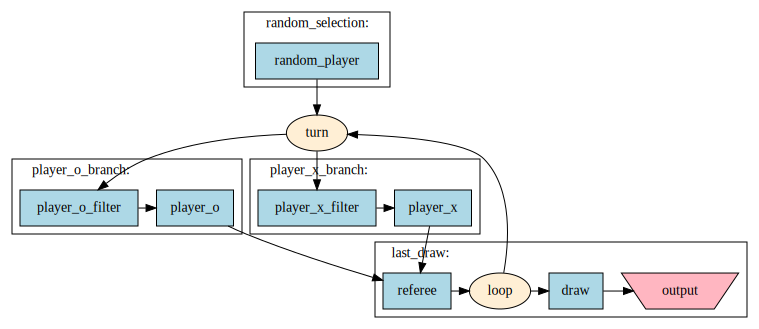

**NOTE:** This graph is identical except the extra `junction:loop` and the line from it that goes all the way back to turn (connection set `looper`).

This configuration results in a non-thrilling game however as only one player ever gets a go!

```text
Player O 

   |   |   
---+---+---
   |   |   
---+---+---
 O |   |   

Player O 

   | O |   
---+---+---
   |   |   
---+---+---
 O |   |   

Player O 

 O | O |   
---+---+---
   |   |   
---+---+---
 O |   |   

Player O WON!

 O | O |   
---+---+---
 O |   |   
---+---+---
 O |   |   
```

#### Alternating players

To get the player taking a turn to alternate we just need to put in some code that swaps the first character between "X" and "O between `junction:loop` and `junction:turn`. This component is called `turn_swapper` in the configuration below:

```yaml file=examples/tic-tac-toe/pa.yaml -d
connection:
  random_selection: "l:random_player | j:turn"
  player_o_branch: "j:turn | l:player_o_filter | l:player_o | j:draw"
  player_x_branch: "j:turn | l:player_x_filter | l:player_x | j:draw"
  last_draw: "j:draw | l:referee | j:loop | l:draw | d:output"
  looper: "j:loop | l:turn_swapper | j:turn"
drain:
  output: { destination: '-' }
launch:
  random_player:
    cmd: "bash"
    arg:
      - '-c'
      - 'echo $((RANDOM % 2))::::::::: | sed "s/1/X/" | sed "s/0/O/"'
  player_o_filter: { cmd: "grep", arg: [ "--line-buffered", "^O" ] }
  player_o:
    cmd: "gawk"
    arg: [ '-F', ':', '-v', 'PLAYER=O', '-f', 'examples/tic-tac-toe/player.awk' ]
  player_x_filter: { cmd: "grep", arg: [ "--line-buffered", "^X" ] }
  player_x:
    cmd: "gawk"
    arg: [ '-F', ':', '-v', 'PLAYER=X', '-f', 'examples/tic-tac-toe/player.awk' ]
  referee:
    cmd: "gawk"
    arg: ['-F', ':', '-f', './examples/tic-tac-toe/referee.awk', 'NF=10', 'OFS=:']
  draw:
    cmd: "gawk"
    arg: [ '-F', ':', '-f', 'examples/tic-tac-toe/draw.awk' ]
  turn_swapper:
    cmd: "sed"
    arg:
      - "--unbuffered"
      - |
        s/^O/9/
        s/^X/O/
        s/^9/X/
```

Which could be visualized as:

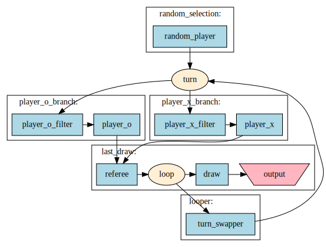

The end result is a (somewhat) realisic looking game of tic-tac-toe where the players take turns and someone wins (or the game ends in a draw):

```text
Player X 

   |   |   
---+---+---
   |   |   
---+---+---
 X |   |   

Player O 

   |   |   
---+---+---
   |   | O 
---+---+---
 X |   |   

Player X 

   | X |   
---+---+---
   |   | O 
---+---+---
 X |   |   

Player O 

   | X | O 
---+---+---
   |   | O 
---+---+---
 X |   |   

Player X 

 X | X | O 
---+---+---
   |   | O 
---+---+---
 X |   |   

Player O 

 X | X | O 
---+---+---
 O |   | O 
---+---+---
 X |   |   

Player X 

 X | X | O 
---+---+---
 O | X | O 
---+---+---
 X |   |   

Player O 

 X | X | O 
---+---+---
 O | X | O 
---+---+---
 X | O |   

DRAW!

 X | X | O 
---+---+---
 O | X | O 
---+---+---
 X | O | X 
```

## Component Types

Component types can be:

*   [**Faucet**](#component-faucet): A source of input when it comes from outside.
*   [**Launch**](#component-launch): A running program that can process data.
*   [**Drain**](#component-drain): Data written here exists Pipeawesome.
*   [**Junction**](#component-junction): A many to many connector which can manage priorities of incoming data.
*   [**Buffer / Regulator**](#component-buffer--regulator): Stores an infinite amount of messages / Regulates the amount of messages

<sub>**Note:** There are diagrams in this section, the legend for this is shown at [#component-diagram-legend](#component-diagram-legend)</sub>

### Component: Faucet

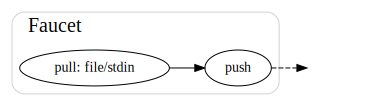

    faucet:
      tap:
        input: "-",

A Faucet is the main way to get data into Pipeawesome. Faucets have a property called `source` which can be "`-`" for STDIN or a filename which will be read from.

### Component: Launch

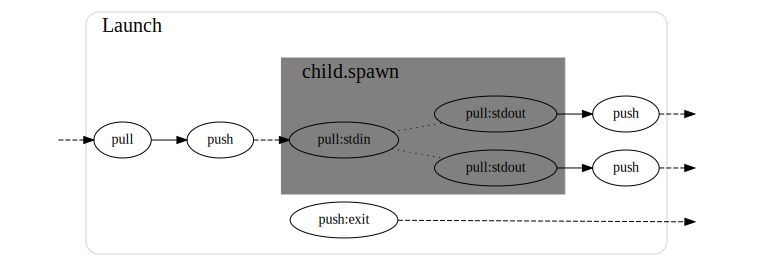

```yaml
launch:
  draw:
    cmd: "awk"
    env:
      AWKLIBPATH: "./lib"
    path: "/home/forbesmyester/project/awesome"
    arg:
      - '-F'
      - ':'
      - '-f'
      - 'examples/tic-tac-toe/draw.awk'
```

This controls how a program is executed.

The following are configurable:

*   **cmd**: The command to run
*   **path**: Where to run it
*   **env**: The environmental variables to run it in
*   **arg**: arguments that will be passed through to the the command

### Component: Drain

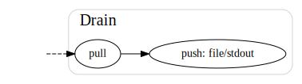

```yaml
drain:
  output:
    destination: '-'
```

This is the normal way to get data out from Pipeawesome. the output can be sent to "`-`" for STDOUT, "`_`" for STDERR or a file, which is specified by using any other value.

### Component: Junction

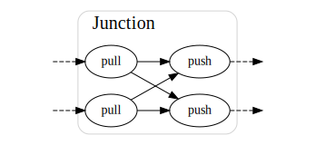

A **Junction** is a many-to-many connector. Anything that comes into one of it's inputs will be sent to all of it's outputs.

There's no configuration for **Junction**, however it is the only component that has any reason to respect input priorities.

<sub>\*\*NOTE: Messages are considered to be seperated by Windows or UNIX line endings. It would be realitvely easy to make this configurable.</sub>

### Component: Buffer & Regulator

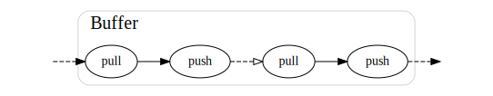

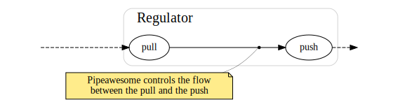

The only components I have not used in the tic-tac-toe example are the **Buffer** and **Regulator**.

Looking back at some of the tic-tac-toe configurations after [Multiple Turns](#multiple-turns) you can see a message is often sent to near the start of the process from very close to the end of the process.

If there are a finite number of messages coming into the system, as in a single game of tic-tac-toe then this is not a problem. However if more and more messages are being added to the system and all the old messages are still being processed, you can see that may be an issue. This situation is unique to loops and is usually handled via backpressure.

The connectors between components have finite capacity ([they are async version of bounded Rust channels](https://docs.rs/async-std/1.9.0/async_std/channel/fn.bounded.html)), which is how our backpressure works, but it does leave a form of deadlock being possible in configurations that include loops.

Below I describe the two components that can be used to control this situation:

*   A **Buffer** is connector with infinite message capacity (it is an [unbounded Rust channel](https://docs.rs/async-std/1.9.0/async_std/channel/fn.unbounded.html)).
*   The **Regulator** can turn on and off the flow of messages passing through it by observing how many messages are in a configured set of Buffers.

The configuration below is a version of the tic-tac-toe configuration above, but modified to run 100,000 games:

```yaml file=./examples/tic-tac-toe/many_games.pa.yaml
connection:
  random_selection: "l:random_player | regulator:regulate_flow | j:turn"
  player_o_branch: "j:turn | l:player_o_filter | l:player_o | j:draw"
  player_x_branch: "j:turn | l:player_x_filter | l:player_x | j:draw"
  last_draw: "j:draw | l:referee | j:loop | l:only_finishes | l:draw | d:output"
  looper: "j:loop | l:turn_swapper | buffer:reprocess | j:turn"
drain:
  output: { destination: '-' }
regulator:
  reg:
    buffered: [10, 100]
    monitored_buffers: [ "reprocess" ]
launch:
  random_player:
    cmd: "bash"
    arg:
      - '-c'
      - 'for i in {1..100000}; do echo $((RANDOM % 2))::::::::: | sed "s/1/X/" | sed "s/0/O/"; done '
  player_o_filter: { cmd: "grep", arg: [ "--line-buffered", "^O" ] }
  player_o:
    cmd: "gawk"
    arg: [ '-F', ':', '-v', 'PLAYER=O', '-f', 'examples/tic-tac-toe/player.awk' ]
  player_x_filter: { cmd: "grep", arg: [ "--line-buffered", "^X" ] }
  player_x:
    cmd: "gawk"
    arg: [ '-F', ':', '-v', 'PLAYER=X', '-f', 'examples/tic-tac-toe/player.awk' ]
  referee:
    cmd: "gawk"
    arg: ['-F', ':', '-v', 'DESIRED_GAME_COUNT=100000', '-f', './examples/tic-tac-toe/referee.awk', 'NF=10', 'OFS=:']
  draw:
    cmd: "gawk"
    arg: [ '-F', ':', '-f', 'examples/tic-tac-toe/draw.awk' ]
  only_finishes:
    cmd: "grep"
    arg:
      - "--line-buffered"
      - "^[DW]"
  turn_swapper:
    cmd: "sed"
    arg:
      - "--unbuffered"
      - |
        s/^O/9/
        s/^X/O/
        s/^9/X/
```

Which could be visualized as:

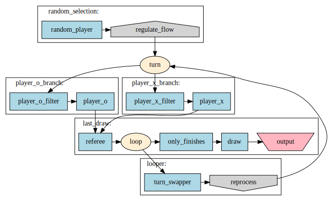

In this situation, the `l:random_player` is creating 100,000 messages instead of just 1, but every one of these will loop back around until the game is complete, so we will have a significant amount of messages. In this configuration, when there are more than 100 messages in `buffer:reprocess`, the `regulator:regulate_flow` will stop accepting messages, but when the amount of messages in the buffer drops below 10, it will resume. Using these two components can solve the problem of issue described above.

## Pipe Variations, Output Types and Input Priorities.

### Pipe Variations

Thinking about passing data between programs, when the recieving program dies or closes it's input, we end up with data coming out from the sending program, but with nowhere for it to go. In this situation I think we have three options:

1.  Terminate (T): Terminate Pipeawesome.
2.  Finish (F): Close the pipe - letting the sending program deal with the problem itself (this will likely cause a cascade effect).
3.  Consume (C): Pipeawesome will keep the pipe open by consuming the data itself (but discarding it).

You can specify the the pipe variation using:

*   `l:sender |T| l:reciever` - Terminate.
*   `l:sender |F| l:reciever` - Finish.
*   `l:sender |C| l:reciever` - Consume.

The normal, single pipe symbol (`l:sender | l:reciever`) is merely a quick way of writing "`|T|`".

### Output Types

A running program may not output all it's output to STDOUT, it can also send data to STDERR.

Pipeawesome allows you to capture when programs output to STDOUT and STDERR but also the EXIT code when the program finishes. This is done by using `[O]`, `[E]` and `[X]` just after the component in the connection set, for example:

```yaml file=./examples/ls/pa.yaml
connection:
  ls_stdout: "l:ls[O] | l:awk_stdout | j:out"
  ls_stderr: "l:ls[E] | l:awk_stderr | j:out"
  ls_exit: "l:ls[X] | l:awk_exit | j:out"
  out: "j:out | d:out"
drain:
  out: { destination: '-' }
launch:
  awk_stdout:
    cmd: awk
    arg: ['{ print "STDOUT: " $0 }']
  awk_stderr:
    cmd: awk
    arg: ['{ print "STDERR: " $0 }']
  awk_exit:
    cmd: awk
    arg: ['{ print "EXIT: " $0 }']
  ls:
    cmd: ls
    arg:
    - "."
    - "i_should_not_exist"
```

NOTE: Infact on UNIX programs can also read & write to `/dev/fdN` where N can be 0 (STDIN), 1 (STDOUT), 2 (STDERR) or other values of N. These other values of N are not currently directly supported.

### Input Priorities

All components except Junction only have one input, but a Junction can have multiple. To control which input to read from we can add priorities, these are specified like the following:

```yaml
connection:
  high_priority: "launch:one_thing | [5]junction:many_to_many"
  low_priority: "launch:something_else | [1]junction:many_to_many"
```

In this example 5 and 1 are priorities, when priorities are not specified, they will be 0. Priorities can also be negative.

## Appendix

### Pipeawesome Graph Legend

You can draw a graph legend by running the command `./target/debug/pipeawesome2 graph --config [YOUR_CONFIG_HERE] --legend-only`. The output will be Graphviz DOT.

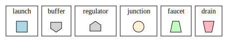

### Component Diagram Legend

This is the legend for diagrams shown in the [Component Types](#component-types) section.

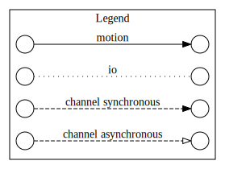
