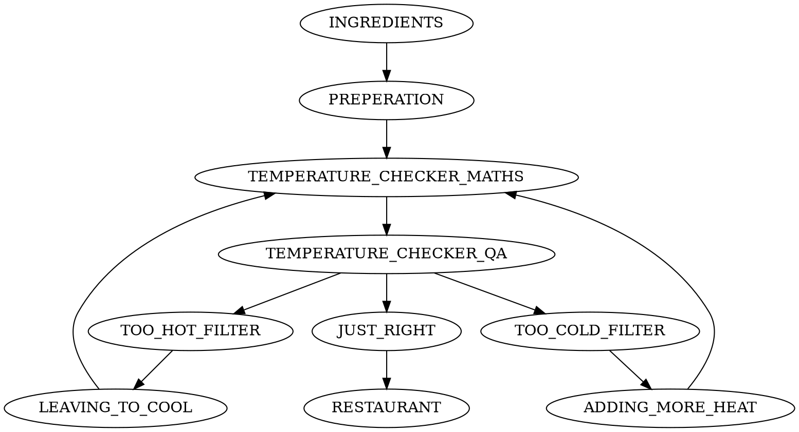
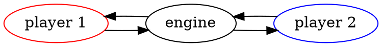

# Pipeawesome 2

## As my mum would say... accusingly... "WHAT did YOU do?!?!?!"

I added loops, branches and joins to UNIX pipes.

## Why did you do this?

I feel UNIX pipes are underappreciated and could be destined for much more.

## So why do you love UNIX pipes?

UNIX pipes are wonderful as when you write software using them they have:

 * High performance.
 * Back Pressure.
 * Really easy to reason about at the individual UNIX process level (it's just STDIN and STDOUT/STDERR).
 * Easy to reason about what data enters individual processes.
 * Insanely light and zero infrastructure compared to a "proper" solution.
 * Easily to integrate with a "proper" solution when the need arises.

## So what does this project add?

So we write a UNIX pipeline like `cat myfile | awk 'PAT { do something }' | grep '^good' | awk '$1='good' { print /dev/stdout } else { print /dev/stderr }' | sed 's/good/perfect' | sort` and this is powerful and wonderful.

This could be visualized like the following:

```unixpipe diagram-dot svg
digraph {
    # rankdir = LR;
    cat -> awk -> grep2 -> awk2 -> sed -> sort

    cat [label="cat myfile", shape="box"]
    grep2 [label="grep '^good'", shape="box"]
    awk [label="awk 'PAT { do something }'", shape="box"]
    sort [shape="box"]
    sed [label="sed 's/good/perfect/'", shape="box"]
    awk2 [label="awk '\l$1='good' {\l    print /dev/stdout; next\l}{\l    print /dev/stderr\l}'\l", shape="box"]
}
```

However it might be that you want to:

```unixpipe diagram-dot svg
digraph {
    # rankdir = LR;
    cat -> awk -> grep1 -> do -> awk2 -> sed -> sort
    awk -> grep2 -> awk2
    awk2 -> awk [label="STDERR"]

    cat [label="cat myfile", shape="box"]
    grep2 [label="grep '^good'", shape="box"]
    awk [label="awk 'PAT { do something }'", shape="box"]
    sort [shape="box"]
    sed [label="sed 's/good/perfect/'", shape="box"]
    awk2 [label="awk '\l$1='good' {\l    print /dev/stdout; next\l}{\l    print /dev/stderr\l}'\l", shape="box"]
    grep1 [label="grep '^bad'", shape="box"]
    do [label="do 'further processing'", shape="box"]
}
```

Some or all of this is possible to do with tools like `mkfifo`, depending on your skill level, but you certainly won't end up with something that is anywhere near as easy for someone to follow as the simple UNIX command we initially wrote out.

## An example project

I decided to make a tic-tac-toe game to demonstrate the capabilities of this project.

This game would have:

 * A data format which can be translated into **a human recognizable tic-tac-toe grid** with squares filled in.
 * Two **computer players**.
 * They would **take turns to pick a blank square** and fill it with their "X" or "O".
 * A **referee** to decide when the game had been won or was a draw.

### Data Format

I first decided on a data format which looks like the following:

STATUS **:** SQUARE_1 **:** SQUARE_2 **:** SQUARE_3 **:** SQUARE_4$ **:** SQUARE_5 **:** SQUARE_6 **:** SQUARE_7 **:** SQUARE_8 **:** SQUARE_9

In this `STATUS` would be either `X`, `O` for player turns or *something else* to denote game draws / wins.

### Drawing the grid

I next coded up something which would show the grid. I coded a lot of this in GNU AWK because it's something that I'm learning off-and-on and (very) simple `STDIN | STDOUT` coding seems ideally suited to the language.

I came up with the following code:

```awk file=./examples/tic-tac-toe/draw.awk
```

You can execute this code with `echo 'X:::X::O' | gawk -F ':' -f ./examples/tic-tac-toe/draw.awk` and it'll draw you the following grid:

```unixpipe echo 'O:::X::O::::X' | gawk -F ':' -f ./examples/tic-tac-toe/draw.awk | wrap-as-lang text
```

I then wrote a Pipeawesome configuration file:

```yaml file=./examples/tic-tac-toe/draw.pa.yaml
```

You could execute this Pipeawesome configuration file with `echo 'O:::X::O::::X' | ./target/debug/pipeawesome2 process --config examples/tic-tac-toe/draw.pa.yaml`

This is of course, a simple, even pointless example, but it allows me to explain the Pipeawesome file format without having you, the reader, have to consider too much complexity.

Lets break it down into it's constituent parts:

#### connection

```yaml
connection:
  initial_word: "faucet:input | launch:draw | drain:output"
```

In this there are pipes, which connect different types of components. The components types here are `faucet`, `launch` and `drain` with the names of those components being `input`, `draw` and `output`.

The names are just names, but they may need to be referenced elsewhere depending on the component type.

Component types can be:

 * **Faucet**: A source of input.
 * **Launch**: A running program.
 * **Drain**: A destination were final data will be sent to.
 * **Buffer**: A buffer can be used to regulate data flow
 * **Junction**: A many to many connector which can manage priorities of incoming data.

The pipes can be extended to configure how to handle broken pipes (when a recieving program exits before a sending program) and you can also control whether they're sending STDIN, STDOUT or EXIT statuses.

#### Component: Faucet

```unixpipe diagram-dot svg
digraph G {
    rankdir=LR
    labeljust=l
    fontsize=20

    subgraph faucet {
        color=lightgrey;
        subgraph cluster_faucet {
            label="Faucet"
            faucet_pull [label="pull: file/stdin"]
            faucet_push [label=push]
            style="rounded"
        }
        fauct_exit_pull [shape=plaintext, label=""]
        faucet_pull -> faucet_push
        faucet_push -> fauct_exit_pull [style=dashed]
    }
}
```

```yaml
faucet:
  input:
    source: '-'
```

The Faucet configuration here is for the one named `input`. It has a property called `source` which can be `-` for STDIN or a filename which will be read from.

#### Component: Launch

```unixpipe diagram-dot svg
digraph G {
    rankdir=LR
    labeljust=l
    fontsize=20
    
    subgraph launch {
        color=lightgrey;
        subgraph cluster_launch {
            label="Launch"
            launch_pull [label=pull]
            launch_stdin_recv_push [label=push]
            
            subgraph cluster_spawn_holder {
                color=white
                label=""
                subgraph cluster_launch_spawn {
                    color=grey
                    label="child.spawn"
                    launch_stdin_recv_pull [label="pull:stdin"]
                    launch_stdout_send_pull [label="pull:stdout"]
                    launch_stderr_send_pull [label="pull:stdout"]
                    style="filled"
                }
                launch_exit_send_push [label="push:exit"]
            }
            launch_stderr_recv_push [label="push"]
            launch_stdout_recv_push [label="push"]
            style="rounded"
        }
        launch_input [shape=plaintext, label=""]
        launch_input -> launch_pull [style="dashed"]
        launch_pull -> launch_stdin_recv_push
        launch_stdin_recv_push -> launch_stdin_recv_pull [style=dashed]
        launch_stdin_recv_pull -> launch_stdout_send_pull [style=dotted, arrowhead=none]
        launch_stdin_recv_pull -> launch_stderr_send_pull [style=dotted, arrowhead=none]
        
        launch_stdout_send_pull -> launch_stdout_recv_push
        launch_stderr_send_pull -> launch_stderr_recv_push
        launch_stdout_recv_push -> launch_stdout_outer [style=dashed]
        launch_stderr_recv_push -> launch_stderr_outer [style=dashed]
        launch_exit_send_push -> launch_exit_outer [style=dashed]
        subgraph cluster_launch_outputs {
            color=white
            launch_stderr_outer [shape=plaintext, label=""]
            launch_stdout_outer [shape=plaintext, label=""]
            launch_exit_outer [shape=plaintext, label=""]
        }
    }

}
```

```yaml
launch:
  draw:
    cmd: "awk"
    arg:
      - '-F'
      - ':'
      - '-f'
      - 'examples/tic-tac-toe/draw.awk'
```

This controls how a program is executed. Further configuration enables the configuration of environmental variables (`env`) and path (`path`).


#### Component: Drain

```unixpipe diagram-dot svg
digraph G {
    rankdir=LR
    labeljust=l
    fontsize=20
    
    subgraph drain {
        color=lightgrey;
        drain_input [shape=plaintext, label=""]
        drain_input -> drain_pull [style="dashed"]
        subgraph cluster_drain {
            label = "Drain"
            drain_pull [label=pull]
            drain_push [label="push: file/stdout"]
            style="rounded"
        }
        drain_pull -> drain_push
    }
}
```

```yaml
drain:
  output:
    destination: '-'
```

Similar to Faucet, output can be sent to `-` for STDOUT, `_` for STDERR, anything else is taken as a filename where data will be wrote to.

## Having a Go

The following configuration includes all the code actual code, but the configuration adds nothing you haven't seen so far

```yaml file=./examples/tic-tac-toe/have_a_go.pa.yaml
```

It can be executed with `echo 'O:::X::O::::X' | ./target/debug/pipeawesome2 process --config examples/tic-tac-toe/have_a_go.pa.yaml`

The output from this will be the same as previous but with an extra `O` on the grid: 

```unixpipe echo 'O:::X::O::::X' | ./target/debug/pipeawesome2 process --config examples/tic-tac-toe/have_a_go.pa.yaml | wrap-as-lang text
```

## Picking a random player to start the game

#### Code for generating the random player
I figured out that `echo $((RANDOM % 2))::::::::: | sed "s/1/X/" | sed "s/0/O/"` is a single line BASH snippet for selecting a random first player. Putting this into the configuration file would give me:

```yaml
launch:
  random_player:
    command: "bash"
    arg:
      - '-c'
      - 'echo $((RANDOM % 2))::::::::: | sed "s/1/X/" | sed "s/0/O/"'
```

But this still means I have to let that player take a turn. This means that I'm going to have to explain how to use Pipeawesome branches.

There are basically two ways to do branching, one is to use a **Launch** STDIN and STDOUT to do the actual splitting and the other is to use a **Junction** with `grep` running on either branch. If you wish to join the branches back together you must use a **Junction**.

#### Component: Junction

(a brief interlude)

```unixpipe diagram-dot svg
digraph G {
    rankdir=LR
    labeljust=l
    fontsize=20
    
    subgraph junction {
        color=lightgrey;
        subgraph cluster_junction {
            label = "Junction"
            junction_push_1 [label=push]
            junction_push_2 [label=push]
            junction_pull_1 [label=pull]
            junction_pull_2 [label=pull]
            style="rounded"
        }
        junction_input_outer_1 [shape="plaintext", label=""]
        junction_input_outer_2 [shape="plaintext", label=""]
        junction_input_outer_1 -> junction_pull_1 [style=dashed]
        junction_input_outer_2 -> junction_pull_2 [style=dashed]
        junction_pull_1 -> junction_push_1
        junction_pull_2 -> junction_push_1
        junction_pull_1 -> junction_push_2
        junction_pull_2 -> junction_push_2
        junction_exit_pull_1 [shape=plaintext, label=""]
        junction_exit_pull_2 [shape=plaintext, label=""]
        junction_push_1 -> junction_exit_pull_1 [style=dashed]
        junction_push_2 -> junction_exit_pull_2 [style=dashed]
    }
}
```

A **Junction** is a prioritized many-to-many connector. Anything that comes into one of it's inputs will be sent to all of it's outputs. There's no configuration for **Junction**, but you can add a priority to it's inputs when you connect them, this is done by using `launch:something | [5]junction:many_to_many` where 5 is the priority, if it is not specified the priority is 0 (negative priorities are allowed).

NOTE: A single message between a windows or unix line ending (\r\n or \n) and includes the line ending itself at the end.


#### Implementation

Adding the Junctions is easy:

##### Diagram

```unixpipe ./target/debug/pipeawesome2 graph --config examples/tic-tac-toe/random_player.pa.yaml -d | diagram-dot svg
```

##### Legend

```unixpipe diagram-dot svg
strict digraph g_get_graph {
    labeljust=l
    subgraph legend {
        color=black
        subgraph cluster_legend_launch {
            label=launch
            legend_launch[label="",shape=box,width=0.3,style=filled,height=0.3]
        }
        subgraph cluster_legend_buffer {
            label=buffer
            legend_buffer[label="",shape=invhouse,width=0.3,style=filled,height=0.3]
        }
        subgraph cluster_legend_junction {
            label=junction
            legend_junction[label="",shape=oval,width=0.3,style=filled,height=0.3]
        }
        subgraph cluster_legend_faucet {
            label=faucet
            legend_faucet[label="",shape=trapezium,width=0.3,style=filled,height=0.3]
        }
        subgraph cluster_legend_drain {
            label=drain
            legend_drain[label="",shape=invtrapezium,width=0.3,style=filled,height=0.3]
        }
    }
}
```

In doing this diagram, I cheated, I wrote the configuration file first and then told Pipeawsome to draw the graph (`./target/debug/pipeawesome2 graph --config examples/tic-tac-toe/random_player.pa.yaml`). But writing the configuration was relatively simple, see below:

```yaml file=./examples/tic-tac-toe/random_player.pa.yaml
```

The changes are:

```yaml
faucet:
  input: { source: '/dev/null' }
```

The Faucet configuration has changed to read input from `/dev/null`. This causes the input close immediately but will feed that empty line into the `random_player` launch.

I did of course add the `random_player` launch as well as `player_o_filter`, `player_x_filter`, `referee` and changed `player` into `player_o` and `player_x`, but the format of Launch should be unsurprising by now.

The big change is that there are now multiple keys / lines within `connection:`. If you look the `random_selection:` connection set writes to `junction:turn` but `junction:turn` is read in both `player_o_branch` and `player_x_branch`, which in turn both write to `junction:referee`. The connection set names are completely arbitrary, though the must be unique, but this is how branching is achieved

## A complete game


Imagine you own a restaurant and you want to check the temperature of soup as it leaves the kitchen:

# cargo build && cat bats-tests/branches/input.txt | ./target/debug/pipeawesome2 graph --config bats-tests/loops/pa.yaml > out.dot &&  cat out.dot | dot -T png >out.png && xdg-open out.png
```dot
digraph {
    rankdir = LR;
    
}
```

To run this file you do the following:

```bash
$  echo -e "44\n90\n92\n99\n33" | pipeawesome \
        --inline --pipeline "$(cat examples/temperature_prope.paspec.json5 | json5)" \
        --input KITCHEN=- --output RESTAURANT=-
TOO_COLD:44
JUST_RIGHT:90
JUST_RIGHT:92
TOO_HOT:99
TOO_COLD:33
```

NOTE 1: `-o RESTAURANT=-` means the output "RESTAURANT" should go to STDOUT.
You can also use an underscore (`_`) to mean STDERR. If it is neither of
these it will be interpreted as a filename which will be wrote to.

NOTE 2: Without `--inline` the `--pipeline` parameter is a filename which must be valid JSON. I wanted to use JSON5 here so I could add meaningful comments, hence the `--inline --pipeline $(cat … | json5)` combination.

## An example which shows how real value could be realized.

Of course, the `TEMPERATURE_CHECKER` probably should send soup that is either too hot, or too cold back to the kitchen where it will either be left to cool or heated up some more:





```bash
$ ./target/debug/pipeawesome -p "$(cat examples/soup_back_to_kitchen.paspec.json5 | json5)" \
        -i INGREDIENTS=tests/pipeawesome/soup_temperature.input.txt \
        -o RESTAURANT=-
4: JUST_RIGHT: 4 + 51 + 2 + 33: 90
3: JUST_RIGHT: 54 + 9 + 26: 89
2: JUST_RIGHT: 56 + 22 + 66 - 6 - 4 - 3 - 7 - 1 - 5 - 3 - 7 - 7 - 4 - 2 - 3: 92
5: JUST_RIGHT: 1 + 1 + 1 + 26 + 29 + 29 + 18 - 4 - 2 - 7: 92
1: JUST_RIGHT: 12 + 5 + 25 + 8 + 16 + 5 + 28 - 5 - 6: 88
^C
```
NOTE: We explain why we had to CTRL-C later on.

### But why did we have to CTRL-C when all the data had been processed?

Pipeawesome will exit when all outputs have been closed (or programs which have no outgoing connections have exited).

In Pipeawesome, when a programs exits, it's output is closed, so we close STDIN for the next program, which could (when it has finished processing) then exit and its output is closed. When each program actually finishes processing and flushes its output is at some indeterminate point in the future and not necessarily related to it's input.

The "problem" occurs when there is a loop. In the example above "PREPERATION" has closed it's own STDOUT but "TEMPERATURE_CHECKER_MATHS" has two more inputs. If you follow it back for one branch:

 * To close "LEAVING_TO_COOL", "TOO_HOT_FILTER" would need to close.
 * To close "TOO_HOT_FILTER", "TEMPERATURE_CHECKER_QA" would need to close.
 * To close "TEMPERATURE_CHECKER_QA", it's own input needs to be closed, which is "TEMPERATURE_CHECKER_MATHS"... which is not going to happen.

This may not be a problem for some software (like server or desktop software) which you may want to keep open. But for tools on the command line it doesn't work very well.

In the above example "PREPERATION" added line numbers to the very beginning of a line. If we want Pipeawesome to exit all we need to do is add a program between "JUST_RIGHT" and "RESTAURANT" which compares those numbers from "PREPERATION" with the ones flowing through itself and closes when it has seen them all.

There are trade-offs writing this program, as we don't know how many numbers there will be but there is a trivial implementation in `pipeawesome-terminator` as well as an example usage which adds just 3 commands in [./examples/perfect_soup.paspec.json](./examples/perfect_soup.paspec.json).

## What are you hoping to achieve?

### My original reason for building this

I have recently created two projects:

 * [eSQLate](https://github.com/forbesmyester/esqlate) - A relatively successful web front end for parameterized SQL queries.
 * [WV Linewise](https://github.com/forbesmyester/wv-linewise) - A pretty much ignored way of putting a [web-view](https://github.com/Boscop/web-view) in the middle of a UNIX pipeline (I think this is awesome but the world does not yet agree).

My plan is to join these two pieces of software together so eSQLate no longer has to run as a web service, but more like ordinary locally installed software.

### A more exciting example

A more graphical and / or exciting way to describe my idea is thinking of a simple turn based strategy game, where:

 * There are two players - each looking at a web-view/GUI window controlled by a separate UNIX processes.
 * There is one "server" which itself is a UNIX process, but without an associated window.

The programs are connected by UNIX pipes as shown below:



When "player 1" moves, the "player 1" software sends that action out over STDOUT which is received by "engine". The "engine" will then send the new game world to both "player 1" and "player 2"

Of course, adding more players is trivial and making it a network based game could be achieved via `netcat`, `ssh` or integration with a proper queueing solution.

## A philosophical question... Are UNIX pipelines microservices?

There has been a big push towards microservices and these are often wired together using Queues. This got me thinking:

 1. Are UNIX pipes actually Queues?
 2. Can we view individual programs as microservices?

For me, while there are caveats, the answers to these questions is YES. I also believe that it would be cheaper, more reliable and faster to build (some) software in this way.


## A more detailed description of the configuration file

The configuration file forms a directed graph.  In the end I designed a JSON (groan) file format as it is somewhat easy to parse for both humans and computers.

For simple, and even at it's most complicated, the configuration looks like the following:


In this file format:

 * Outputs are listed in the `outputs` property of the JSON file.
 * Inputs are simply found by finding the `src`'s of the `commands` which are themselves not commands. In the example above "KITCHEN" does not exist as a command so it has become an input. It is perfectly permissible to have no inputs and start with commands that themselves produce data.

Because file format forms a directed graph, the following is possible:

 * If you want to do a branch, you just list multiple commands coming from the same "src".
 * If you want to do a join you have one command with multiple "src".
 * Loops are achieved by a branch and a join back onto itself.

The only other thing to note is that commands have three outputs "OUT" "ERR" and "EXIT". Which are STDOUT, STDERR and the exit status of a command.

## Building

This is a [Rust](https://www.rust-lang.org/) project. I used [RustUp](https://rustup.rs/) to install Rust (1.45) which is very easy to nowadays.

I have developed and tested this on Ubuntu 20.04 and have done rudimentary testing on Windows. I have not tested it on MacOS yet but it compiled and ran first time on Windows so it's probably going to be OK... If not PR's are always welcome 😃.

## Generating Graphs

    TMP_DIR=$(mktemp -d)
    ./target/debug/pipeawesome2 graph --legend-only  --config bats-tests/word_ladders_basic/pa.yaml | dot -Tpng > "${TMP_DIR}/legend.png"
    ./target/debug/pipeawesome2 graph --diagram-only --config bats-tests/word_ladders_basic/pa.yaml | dot -Tpng > "${TMP_DIR}/diagram.png"
    convert "${TMP_DIR}/diagram.png" "${TMP_DIR}/legend.png" -gravity east -append full_diagram.png
    xdg-open full_diagram.png
    rm -rf "${TMP_DIR}"

```unixpipe diagram-dot svg
digraph G {
    rankdir=LR
    subgraph cluster_legend {
        label="Legend"
        a [label=""]
        b [label=""]
        c [label=""]
        d [label=""]
        e [label=""]
        f [label=""]
        g [label=""]
        h [label=""]
        a -> b [label=motion]
        c -> d [label=io, style=dotted, arrowhead=none]
        e -> f [label="channel synchronous", style=dashed]
        g -> h [label="channel asynchronous", style=dashed, arrowhead=empty]
    }
}
```

Generate this documentation with: `matts-markdown -m README.src.md > README.md && matts-markdown README.src.md > README.html && refresh-browser firefox`


